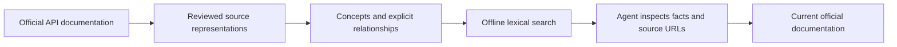

# OpenAI API Documentation CKG

[](https://github.com/Yarmoluk/ckg-openai-api-docs/actions/workflows/validate.yml)
[](https://yarmoluk.github.io/ckg-openai-api-docs/)
[](https://www.python.org/)

**Source-linked context for agents building with OpenAI's APIs.** Search model constraints, tool contracts and request schemas, then follow each result back to the official documentation.


**[Start with the Astra reference →](https://yarmoluk.github.io/ckg-openai-api-docs/astra.html)** Follow the model's documented connections to Responses, async tools, steering, reasoning and conversation state. The documentation includes a visual map generated from five exact graph relationships and a worked question-to-source example.

This independent research preview organizes **541 indexed documentation entries into 2,889 nodes and 4,731 declared relationships**. It runs locally with Python's standard library: no API key, hosted service or embedding database.

> Original HTTP response hashes are not yet verified. The retained parser captures have hashes, but those are a different form of evidence. The graph is not independently benchmarked or approved for production reliance.

## What it does

| Developer question | Graph context |
|---|---|
| Can Astra use function calling through Chat Completions? | Model compatibility and the documented Responses requirement. |
| Can async tools run alongside other work? | Application execution ownership, result correlation and compatibility limits. |
| How do reasoning changes interact with compaction and caching? | Explicit configuration constraints and lifecycle behavior. |
| What fields does an organization endpoint require? | Source-linked request-schema nodes. |

## Run it

```bash
git clone https://github.com/Yarmoluk/ckg-openai-api-docs.git
cd ckg-openai-api-docs
python3 scripts/query.py "Astra function calling Chat Completions" --limit 3
python3 scripts/query.py "configuration_update compaction"
python3 scripts/query.py "create organization group name constraints"
```

Results contain facts, official source URLs, provenance status and outgoing declared relationships. This is lexical retrieval over structured facts; it does not generate an answer or guarantee relevance.

An agent can run the same command, inspect the returned facts, and cite their source URLs. For prices, availability or consequential implementation choices, verify the current official page before using a snapshot.

## Architecture



Navigation and section membership use RELATES_TO. Only two documented requirements use REQUIRES. The graph does not turn every hyperlink into a prerequisite.

## Explore

- [Documentation site](https://yarmoluk.github.io/ckg-openai-api-docs/) — architecture, quickstart, evaluation and provenance.
- [Readable CKG](data/ckg-openai-api-docs.md), [JSON](data/graph.json), [CSV](data/graph.csv).
- [Source inventory](data/sources.json) — original indexed URLs and resolved evidence URLs.
- [Twenty practical questions](evals/questions.json) and [author-reviewed answers](evals/answers.json).
- [Source and claim boundaries](docs/provenance.md).

## Evaluation

The author reviewed answers to 20 frozen practical questions. The initial graph supported 16 complete answers, one partial answer, two evidence-limited answers and one correct abstention. Repairs produced 19 complete answers and one correct abstention.

These are **same-agent diagnostic judgments**, not a blinded or independent benchmark. The replay checks retrieval of the cited nodes; it does not re-grade semantic correctness. No superiority over RAG, another graph, or an unassisted model is claimed.

```bash
python3 scripts/validate.py
python3 scripts/evaluate.py
```

## Documentation site

```bash
python3 -m venv .venv
source .venv/bin/activate
pip install -r requirements-docs.txt
mkdocs serve
# Or: mkdocs build --strict
```

GitHub Actions validates the package and deploys documentation on pushes to main when GitHub Pages is configured to use Actions.

## Repository layout

```text
data/       Graph formats, public source ledger and export checksums
scripts/    Offline search, validation, evaluation replay and candidate export
evals/      Frozen questions, manual answers and initial graph for replay
docs/       MkDocs Material documentation
.github/    Validation and Pages deployment workflows
```

The canonical graph version lives in data/graph.json. The Markdown version is generated from it during export.

## Scope and attribution

Coverage is the indexed API guides, reference and model collections captured on September 18, 2026. Separate Codex, Apps SDK and other developer-site collections are outside this graph. Selected statements and request schemas are encoded; this is not every assertion in every document.

This independent [Graphify.md](https://graphifymd.com) project is not affiliated with or endorsed by OpenAI. Original software uses the MIT license; upstream documentation retains its own rights. See [NOTICE.md](NOTICE.md).
