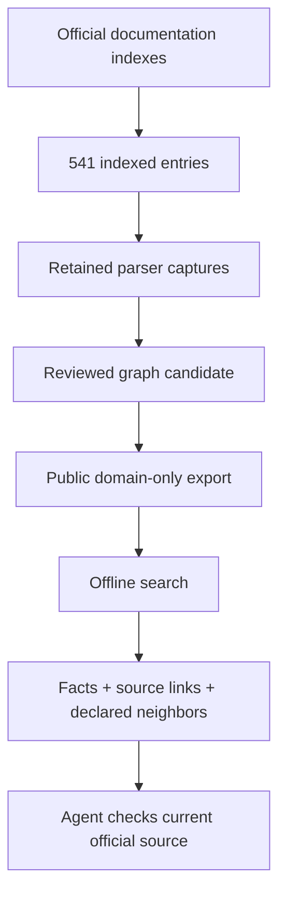
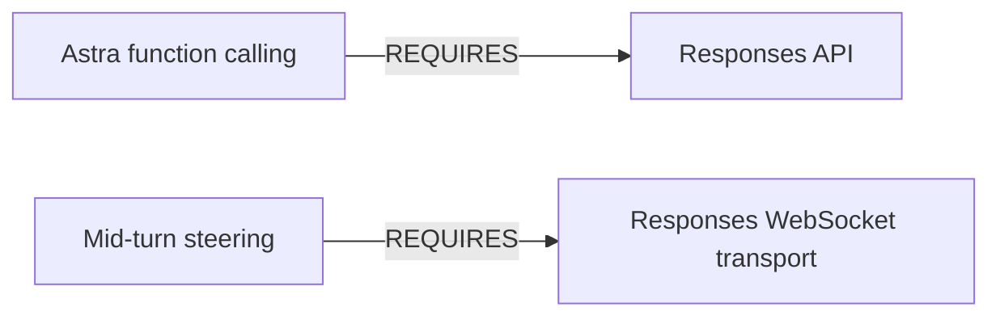

# Architecture

The CKG makes documented facts and relationships explicit so a coding agent can inspect them before deciding how to call an API.

## Four node layers

| Layer | Count | Contents |
|---|---:|---|
| Document | 541 | One node per indexed entry; some entries share a redirected destination. |
| Guide/model section | 2,248 | Selected paragraphs, model tables and feature/tool lists. |
| Request schema | 77 | Recovered explicit path, query and body parameters. |
| Semantic concept | 23 | Agent-reviewed constraints and lifecycle concepts. |

The entry count is not a count of distinct final URLs: the ledger has 538 distinct evidence URLs after redirects.

## Relationships say what is known

- RELATES_TO represents a documented link, section membership or a claim's relationship to its source document.
- REQUIRES represents two explicit requirements: Astra function calling uses Responses, and mid-turn steering uses Responses WebSocket transport.
- No API dependency is inferred merely because one page links to another.
- No requirement says that a developer must read a particular documentation page.

## Retrieval

The offline query tool ranks label and fact terms using a BM25-style score with label weighting. It returns matching facts and outgoing declared neighbors. It does not run an LLM, browse live sources or resolve contradictions automatically.

An agent can use the CLI output as context. There is no new MCP server or background service in this repository.

## Public boundary

The export contains domain facts and official source URLs. Full captures, local evidence-file paths, private workspace records and tool execution logs remain outside the repository. Export checksums let a reader verify the packaged files; they do not verify the original website bytes.
