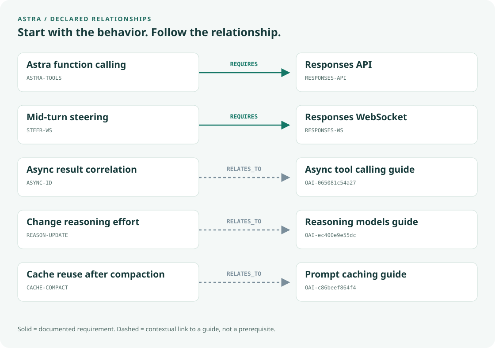

<div class="hero hero-astra" markdown>

<div class="hero-content">
<p class="eyebrow">Graphify.md · community documentation</p>
<h1>Build with Astra.<br>Understand the API around it.</h1>
<p class="lede">A source-linked guide to the model, its tools, and the conversation state your application manages.</p>
<div class="hero-actions">
<a class="md-button md-button--primary" href="astra.html">Start with the Astra reference</a>
<a class="md-button" href="#the-graph-in-five-relationships">Read the graph</a>
</div>
</div>
</div>

## What is this documentation for?

When you build with a model, the model name is only the beginning. You also choose an API, configure reasoning, connect tools, preserve conversation state and manage cost.

**This reference uses GPT-6 Astra as a starting point for those decisions.** The underlying Compact Knowledge Graph (CKG) stores selected documentation facts as named concepts, connects them through declared relationships, and keeps the official source attached.

You can read the explanations here, inspect the graph, or let a coding agent search the same facts locally.

<div class="signal-grid" markdown>
<div class="signal-card" markdown>
### 01 · Ask a concrete question
“Can our Astra app keep function calling on Chat Completions?”
</div>
<div class="signal-card" markdown>
### 02 · Inspect the relationship
The graph records that Astra function calling requires the Responses API.
</div>
<div class="signal-card" markdown>
### 03 · Check the source
Follow the official reasoning guide before changing the integration.
</div>
</div>

The example above comes from [OpenAI's reasoning documentation](https://developers.openai.com/api/docs/guides/reasoning), represented by ASTRA-TOOLS and RESPONSES-API.

## Astra at a glance

| Reference point | Documentation snapshot |
|---|---|
| Model identifier | gpt-6-astra |
| Input / output | Text and image input; text output |
| Context window | 1,050,000 tokens |
| Maximum output | 128,000 tokens |
| Reasoning levels | low, medium, high, xhigh, max |

Source: [official Astra model page](https://developers.openai.com/api/docs/models/gpt-6-astra), checked September 18, 2026. The full context window is not the same as the maximum output allowance.

[See practical settings and constraints](astra.md){ .md-button }

## The graph in five relationships

Read each row from left to right: **the behavior you care about → the declared relationship → the API or source guide to inspect**.

<div class="graph-frame">

</div>

**Solid arrows are requirements. Dashed arrows are contextual links.** A link to a guide does not mean that the guide is a software dependency. These five edges are checked against the repository's graph whenever documentation is built.

| Starting concept | What to check next |
|---|---|
| Astra function calling | [Responses requirement](astra.md#choose-the-api-for-tool-calls) |
| Mid-turn steering | [Transport and execution limits](astra.md#redirect-a-running-response) |
| Async tool results | [Application ownership and result IDs](astra.md#let-tools-work-asynchronously) |
| Reasoning updates | [Configuration and cache compatibility](astra.md#manage-reasoning-and-conversation-state) |
| Compaction and caching | [What survives and what may change](astra.md#manage-reasoning-and-conversation-state) |

## Follow one question from graph to source

**Question:** “We already use Chat Completions. Can we move to Astra and keep our function-calling code?”

1. Search for the behavior:
   ```bash
   python3 scripts/query.py "Astra function calling Chat Completions" --limit 3
   ```
2. Inspect ASTRA-TOOLS and its REQUIRES edge to RESPONSES-API.
3. Read the [official compatibility statement](https://developers.openai.com/api/docs/guides/reasoning).
4. Use that finding to plan the tool-calling migration. Test the application change separately.

The command returns graph facts and citations. Your agent or developer still decides how to implement the change.

## What is behind this reference?

**541 indexed entries · 2,889 concepts · 4,731 relationships**

The collection spans API guides, model pages and endpoint reference. The Astra page is an entry point into that broader collection. Selected facts are encoded; the graph does not contain every detail of every document.

[Run the offline lookup](quickstart.md){ .md-button }
[Understand the architecture](architecture.md){ .md-button }

!!! note "Evidence and review"
    The graph has structural checks and a 20-question author-reviewed diagnostic audit. Independent evaluation and original HTTP response-byte verification remain pending. See [evaluation](evaluation.md) and [provenance](provenance.md) for the exact scope. Recheck changing API details before operational use.

The header is an original, AI-generated illustration. The technical graph is generated from declared relationships. This independent project is not affiliated with or endorsed by OpenAI.
